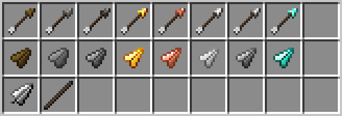

# ArrowCrafting

[LICENSE](LICENSE.md)

**ArrowCrafting** is a Fabric mod that adds new types of arrows and arrowheads, providing players with more combat options and varying arrow damage outputs.

## Items

### Arrow Heads
4 Arrow heads are crafted from 3 pieces of the respective material and are used as crafting components for their respective arrow types.

### Arrow Shafts
Arrow shafts are crafted from 3 diagonally arranged pieces of either sticks, bamboo or sugar cane.
Crafting from sticks is gives 2 shafts, while crafting from bamboo or sugar cane gives 4 shafts.

### Arrow Fletching
Arrow fletchings are crafted from either fethers or paper.
Crafting from fethers is gives 8 fletchings, while crafting from paper gives 4 fletchings.

### Arrows
There are new arrow types, that work exactly like vanilla arrows, but have a damage multiplier.
This makes them compatible with all vanilla modifiers.

New arrow types:
- **Wooden Arrow**: 50%
- **Stone Arrow**: 80%
- **Flint Arrow**: 100%
- **Gold Arrow**: +10%
- (*Placeholder for my coming Copper Crafting*) : +20%
- **Iron Arrow**: +30%
- (*Placeholder for my Steel Crafting mod*) : +40%
- **Diamond Arrow** : +80%

## Installation

The compiled mod JAR can be found in the `build/libs/` directory of this repository after running the build task.

1. Download the mod version you need for your minecraft version.
2. Ensure you have the matching version of Fabric installed and have a profile for it.
3. Place the JAR into the `mods` folder of your Minecraft instance.  
4. Launch Minecraft with the Fabric profile. 