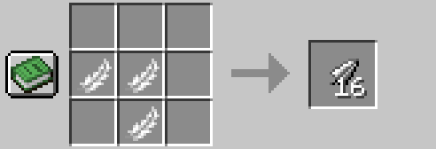

# ArrowCrafting

[LICENSE](LICENSE.md)

**ArrowCrafting** is a Fabric mod that adds new types of arrows based on the vanilla tool materials.
The goal was to make Ranged gameplay more interesting by adding a new layer of progression, just like other item types have.
Arrows are crafted from arrow heads, arrow shafts and arrow fletchings.
Vanilla arrows can not be crafted with this mod, but can still be dropped or found in the world.

This mod also adds integration of my following mods:
- [CopperCrafting](https://www.curseforge.com/minecraft/mc-mods/coppercrafting)
- [SteelCrafting](https://www.curseforge.com/minecraft/mc-mods/steelcrafting)

If either of these mods is installed, the respective arrow heads and arrows will be added.

## Items

### Arrow Heads
**8 Arrow heads** are crafted from 3 pieces of the respective material and are used as crafting components for their respective arrow types.

- Wooden Arrow Head
- Stone Arrow Head
- Flint Arrow Head
- Gold Arrow Head
-   > Copper Arrow Head | *Optional, when [CopperCrafting](https://www.curseforge.com/minecraft/mc-mods/coppercrafting) is installed.*
- Iron Arrow Head 
-   > Steel Arrow Head | *Optional, when [SteelCrafting](https://www.curseforge.com/minecraft/mc-mods/steelcrafting) is installed.*
- Diamond Arrow Head

### Arrow Shafts
Arrow shafts are crafted from 3 diagonally arranged pieces of either sticks, bamboo or sugar cane.
Crafting from sticks is **gives 2 shafts**, while crafting from bamboo or sugar cane gives **4 shafts**.

### Arrow Fletching
Arrow fletchings are crafted from either fethers or paper.
Crafting from fethers is gives **16 fletchings**, while crafting from paper gives **8 fletchings**.

### Arrows
There are new arrow types, that work exactly like vanilla arrows, but all have different damage values.
- Damage changes compared to vanilla arrows are implemented as multipliers / percentages, so they are compatible with all vanilla modifiers.
- The ***Infinity*** enchantment is not supported on purpose, as it breaks any kind of balance.
- They are crafted from 1 arrow head, 1 arrow shaft and 1 arrow fletching.

**Arrow types:**
- **Wooden Arrow**: **40%** 
- **Stone Arrow**: **70%** 
- **Flint Arrow**: Base damage. 
- **Gold Arrow**: **+20%** 
-   > **Copper Arrow**: **+30%** | *Optional, when [CopperCrafting](https://www.curseforge.com/minecraft/mc-mods/coppercrafting) is installed.*
- **Iron Arrow**: **+50%** 
-   > **Steel Arrow**: **+60%** | *Optional, when [SteelCrafting](https://www.curseforge.com/minecraft/mc-mods/steelcrafting) is installed.*
- **Diamond Arrow** : **+100%** 

## Installation

The compiled mod JAR can be found in the `build/libs/` directory of this repository after running the build task.

1. Download the mod version you need for your minecraft version.
2. Ensure you have the matching version of Fabric installed and have a profile for it.
3. Place the JAR into the `mods` folder of your Minecraft instance.  
4. Launch Minecraft with the Fabric profile. 