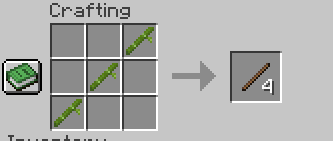

# ArrowCrafting

[LICENSE](LICENSE.md)

**ArrowCrafting** is a Fabric mod that adds new types of arrows based on the vanilla tool material progression.
Vanilla arrows can not be crafted with this mod.
Arrows are crafted from arrow heads, arrow shafts and arrow fletchings.

## Items

### Arrow Heads
4 Arrow heads are crafted from 3 pieces of the respective material and are used as crafting components for their respective arrow types.

- Wooden Arrow Head
- Stone Arrow Head
- Flint Arrow Head
- Gold Arrow Head
- Copper Arrow Head
- Iron Arrow Head
- Diamond Arrow Head

### Arrow Shafts
Arrow shafts are crafted from 3 diagonally arranged pieces of either sticks, bamboo or sugar cane.
Crafting from sticks is gives 2 shafts, while crafting from bamboo or sugar cane gives 4 shafts.

  

### Arrow Fletching
Arrow fletchings are crafted from either fethers or paper.
Crafting from fethers is gives 8 fletchings, while crafting from paper gives 4 fletchings.

 

### Arrows
There are new arrow types, that work exactly like vanilla arrows, but have a damage multiplier.
This makes them compatible with all vanilla modifiers.
They are crafted from 1 arrow head, 1 arrow shaft and 1 arrow fletching.

New arrow types:
- **Wooden Arrow**: **40%** 
    - *~5 hits for a normal mob.*
- **Stone Arrow**: **60%** 
    - *~4 hits for a normal mob.*
- **Flint Arrow**: Base damage. 
    - *~3 hits for a normal mob.*
- **Gold Arrow**: **+10%** 
    - *~2-3 hits for a normal mob.*
- **Copper Arrow**: **+20%** 
    - ***Optional**, when [CopperCrafting](https://www.curseforge.com/minecraft/mc-mods/coppercrafting) is installed.*
    - *~2-3 hits for a normal mob.*
- **Iron Arrow**: **+40%** 
    - *~2 hits for a normal mob.*
- **Diamond Arrow** : **+100%** 
    - *~1-2 hits for a normal mob.*

## Installation

The compiled mod JAR can be found in the `build/libs/` directory of this repository after running the build task.

1. Download the mod version you need for your minecraft version.
2. Ensure you have the matching version of Fabric installed and have a profile for it.
3. Place the JAR into the `mods` folder of your Minecraft instance.  
4. Launch Minecraft with the Fabric profile. 